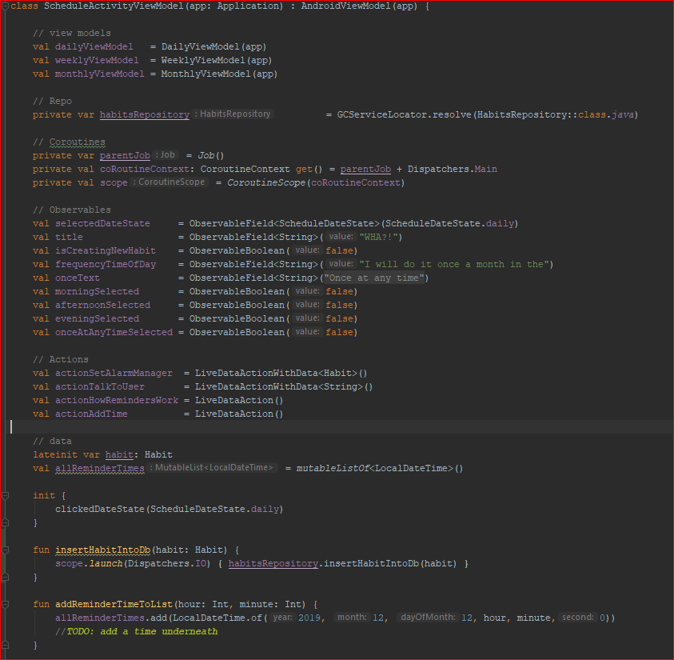
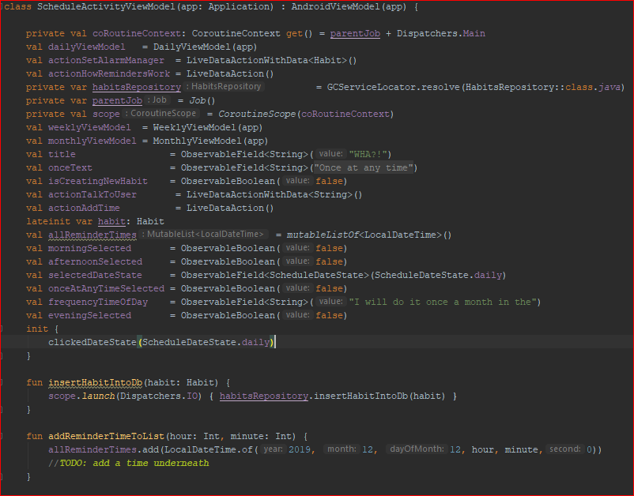

# bignerdranch

Please provide a code sample that exemplifies an important aspect of your coding philosophy and tell us why. 

ScheduleActivityViewModel.kt

My answer: Keep variables organized.

## vs.

